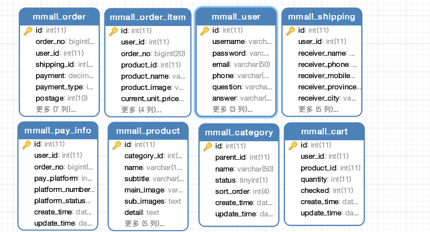

## Tmmall 电商平台后端项目

#### 项目简介

> 基于Spring+SpringMvc+Mybatis系统架构，包含的基本模块有用户管理、商品信息管理、购物车模块、订单模块、对接支付宝支付模块，使用[阿里云OSS对象存贮](https://www.aliyun.com/product/oss?utm_content=se_1250487)做商品的图床，此为商城的后端代码，前端界面项目，[点这里](https://github.com/Allenskoo856/TmallFontEnd)

---

#### 项目开发环境

**IDEA + Maven + Tomcat8 + Git + Mysql + Redis**

#### 涉及到的相关技术

**Spring Framework + SpringMVC + MyBatis + Mybatis PageHelper + Redis + Logback +Guava**

####  项目目录

```java
main
    ├─java
    │  └─com
    │      └─mmall
    │          ├─aliyunoss     // aliyunOSS存贮接口封装
    │          ├─common		  // 公共包
    │          ├─controller    // controller
    │          │  ├─backend	   // 后台管理员接口
    │          │  ├─common     // 公共接口
    │          │  └─portal     // 前台用户接口
    │          ├─dao           // 数据库封装
    │          ├─pojo		  // 数据对象
    │          ├─service  	  // 业务层
    │          │  └─impl	// 业务层实现
    │          ├─util		// 工具包
    │          └─vo			// 表示层对象
    ├─resources			    // ssm xml配置
    │  └─mappers
    ├─resources.dev			// 开发环境
    ├─resources.pro			// 线上环境
    └─webapp
        └─WEB-INF
            └─lib
```

#### 数据库表设计



---

#### 后台详细的接口文档

| 编号 |        接口        | 详情 |
| :--: | :----------------: | :--: |
|  1   |  前台商品模块接口  | 文档 |
|  2   |  前台用户模块接口  | 文档 |
|  3   |  前台订单模块接口  | 文档 |
|  4   |  前台支付模块接口  | 文档 |
|  5   | 前台购物车模块接口 | 文档 |
|  6   |  后台品类模块接口  | 文档 |
|  7   |  后台订单模块接口  | 文档 |
|  8   |  后台产品模块接口  | 文档 |
|  9   |  后台用户模块接口  | 文档 |

---

#### 如何使用

- 安装git客户端，克隆项目

  ```g
  git clone https://github.com/Allenskoo856/TmallBackEnd.git
  ```

- 修改配置文件 resource-dev：**datasource.properties**、**mmall.properties**、**zfbinfo.properties**

- maven打包

  ```java
  mvn clean package -Dmaven.skip.test=true -Pdev
  ```

 将打包之后的war文件发布到Tomcat目录下的WebAPP即可。